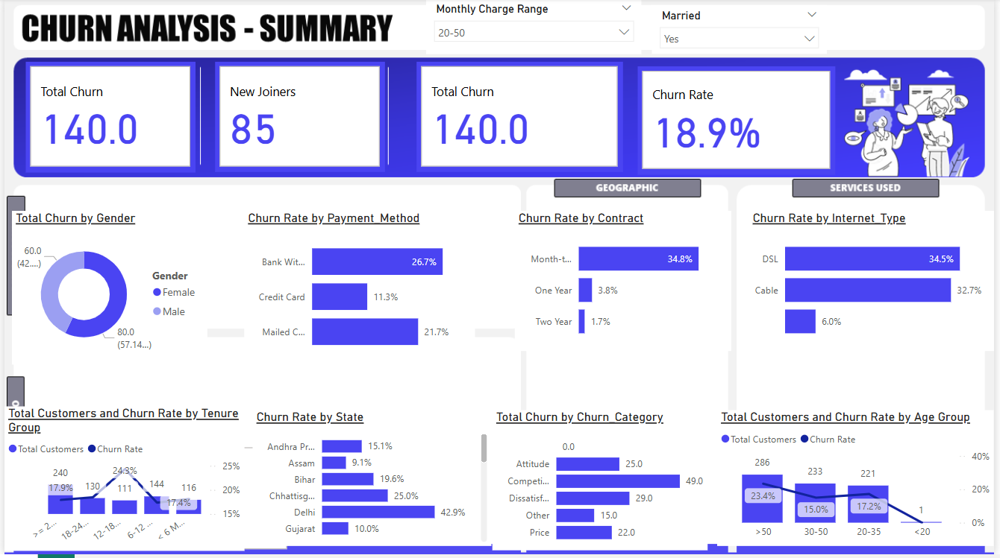

# 📊 Churn Analysis Dashboard - Power BI

A comprehensive Power BI dashboard for analyzing customer churn across various demographic and service dimensions. This solution enables businesses to identify key drivers of churn and take action to improve customer retention.

# Glimpse of Dashboard


---

## 🎯 Objective

The goal of this dashboard is to provide data-driven insights into customer churn patterns. By visualizing churn across multiple dimensions such as gender, contract type, payment method, age group, and geographic location, decision-makers can:

- Identify high-risk customer segments.
- Discover behavioral patterns linked to churn.
- Improve retention strategies through targeted interventions.

---

## 🧠 Domain Knowledge

**Customer Churn** refers to the phenomenon of customers discontinuing service or switching to competitors. In highly competitive industries such as telecommunications, understanding churn behavior is critical for:

- Reducing revenue loss.
- Enhancing customer satisfaction.
- Increasing customer lifetime value (CLV).

Key dimensions typically analyzed:
- **Demographics** (e.g., gender, age, marital status)
- **Service Details** (e.g., internet type, contract length)
- **Engagement Patterns** (e.g., tenure, payment method)
- **Customer Feedback** (e.g., churn reason/category)

---

## 💻 Requirements

To view or interact with the dashboard, you need:

- [Power BI Desktop](https://powerbi.microsoft.com/desktop/) (Version 2.0 or later)
- Dataset containing customer churn data with fields such as:
  - Customer ID, Gender, Age
  - Contract Type, Internet Service Type
  - Payment Method, Tenure
  - Churn Flag, Churn Category

---

## 🚀 Usage

1. **Clone the Repository:**
   ```bash
   git clone https://github.com/Anusha567878/crm-customer-churn-analysis-SQL-PowerBI.git```
